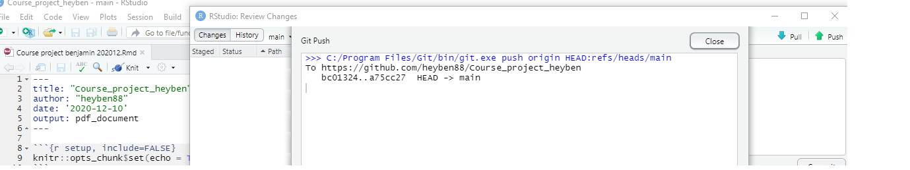
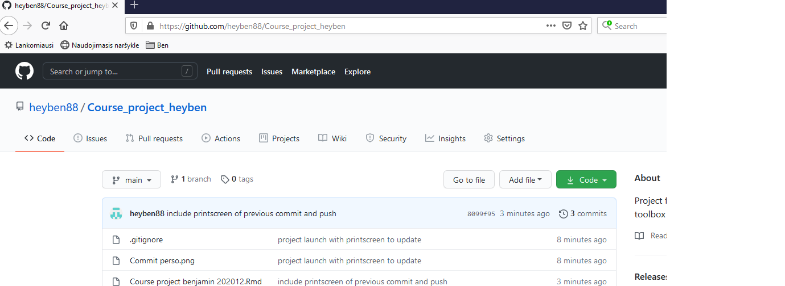
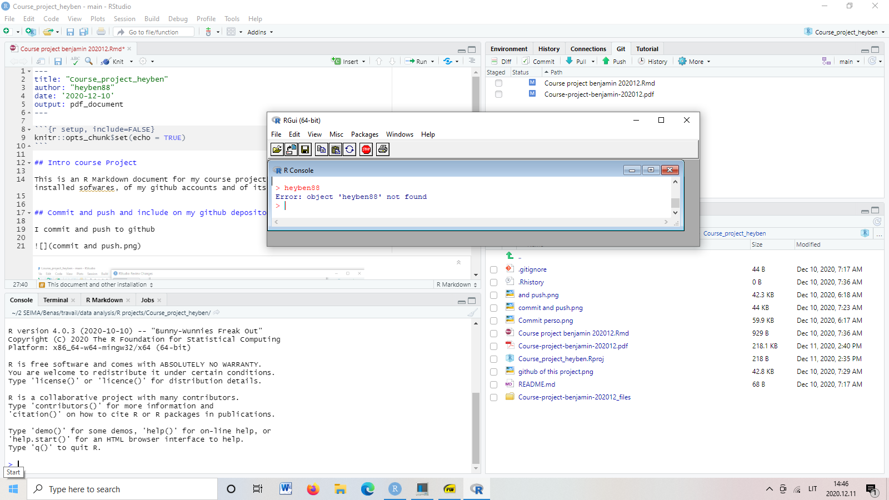

```{r setup, include=FALSE}
knitr::opts_chunk$set(echo = TRUE)
```

## Intro course Project

This is an R Markdown document for my course project. It will be filled with printscreen of the installed sofwares, of my github accounts and of itself.


## Commit and push and include on my github depository

I commit and push to github



My github page for this project:



## This document and other installation

I succesfully installed R and R studio.  


## previous test from the cloned document

```{r cars}
summary(cars)
```

## Including Plots

You can also embed plots, for example:

```{r pressure, echo=FALSE}
plot(pressure)
```

Note that the `echo = FALSE` parameter was added to the code chunk to prevent printing of the R code that generated the plot.
